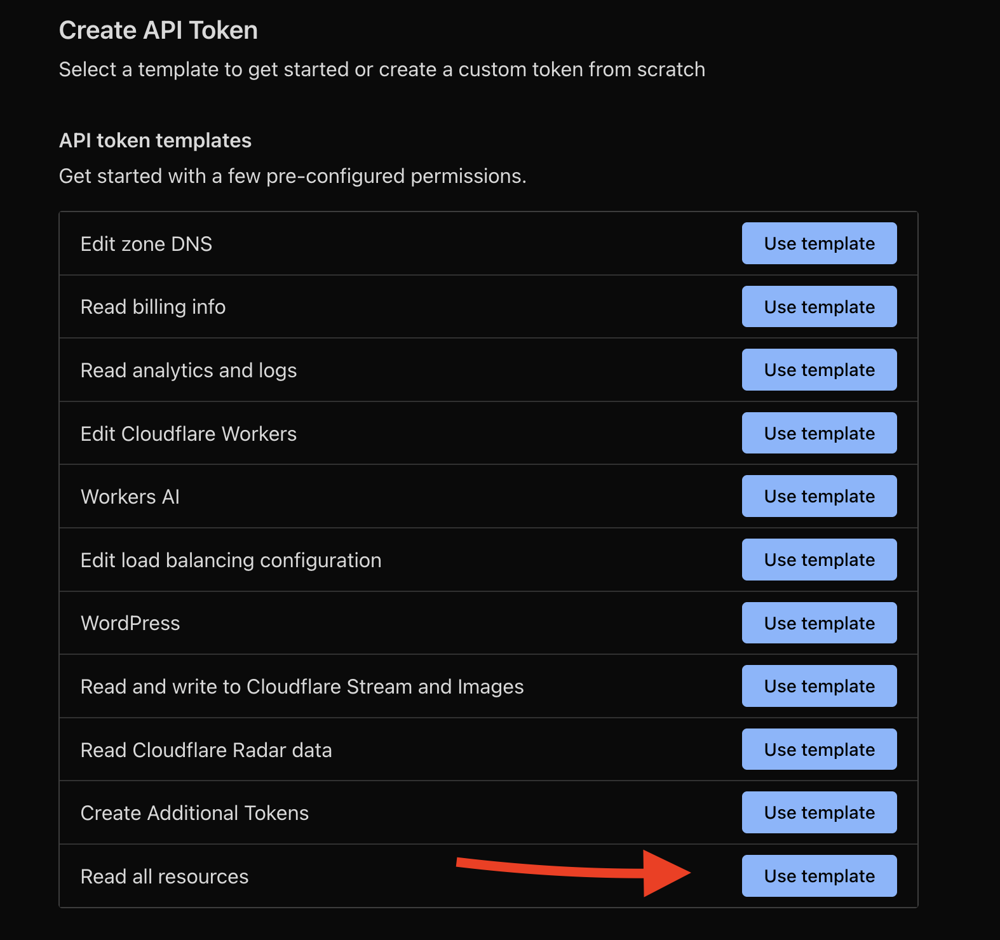

# FlareInspect 🔍

<div align="center">
  
  
  <br><br>
  
  
  
  
  
  
</div>

<div align="center">
  <h3>Enterprise-grade Cloudflare Security Assessment Tool</h3>
  <p>Built with ❤️ by <a href="https://ionsec.io">IONSEC.IO</a></p>
</div>

---

## 🚀 Overview

FlareInspect is a comprehensive command-line tool for assessing the security configuration of Cloudflare accounts and zones. It performs automated security checks across multiple categories including DNS security, SSL/TLS configuration, WAF settings, Zero Trust policies, and integrates with Cloudflare Security Center to analyze real-time security insights and threats.

### Key Features

- 💬 **Interactive Mode**: Launch with a single command for an intuitive CLI experience
- 🔒 **Comprehensive Security Assessment**: Evaluates 30+ security controls across multiple categories
- 🔍 **Security Insights Integration**: Analyzes Cloudflare Security Center insights for proactive threat detection
- 📊 **OCSF-Compliant Output**: Exports findings in Open Cybersecurity Schema Framework format
- 📈 **Beautiful HTML Reports**: Generate professional security assessment reports
- 🐳 **CVE-Free Docker Support**: Security-hardened containerized deployment with zero vulnerabilities
- 🎯 **Enhanced Zero Trust Analysis**: Comprehensive assessment of Cloudflare Zero Trust configurations with latest SDK support
- 🌐 **Multi-Zone Support**: Analyze all zones in your Cloudflare account
- 📋 **Compliance Mapping**: Maps findings to SOC2, ISO27001, PCI-DSS, NIST, and CIS frameworks
- 🛡️ **Security Hardened**: Built with enterprise security best practices and vulnerability-free dependencies

## 📋 Table of Contents

- [Installation](#installation)
  - [NPM Installation](#npm-installation)
  - [Docker Installation](#docker-installation)
  - [From Source](#from-source)
- [Cloudflare API Permissions](#cloudflare-api-permissions)
- [Usage](#usage)
  - [Basic Assessment](#basic-assessment)
  - [Export Options](#export-options)
  - [Docker Usage](#docker-usage)
- [Commands](#commands)
- [Output Formats](#output-formats)
- [Security Checks](#security-checks)
- [Configuration](#configuration)
- [Examples](#examples)
- [Security](#security)
- [Troubleshooting](#troubleshooting)
- [Contributing](#contributing)
- [License](#license)

## 🛠️ Installation

### NPM Installation

```bash
npm install -g flareinspect
```

### Docker Installation

```bash
# Pull the CVE-free security-hardened image
docker pull ionsec/flareinspect:latest

# Or build locally (includes security scanning)
docker build -t flareinspect .
```

**🛡️ Security**: Our Docker image is 100% CVE-free with zero critical, high, or medium severity vulnerabilities. Built with Node.js 22 and Alpine Linux 3.22 with comprehensive security hardening.

### From Source

```bash
# Clone the repository
git clone https://github.com/ionsec/flareinspect.git
cd flareinspect

# Install dependencies
npm install

# Make CLI executable
chmod +x src/cli/index.js

# Create symlink (optional)
npm link
```

## 🔑 Cloudflare API Permissions

FlareInspect requires a Cloudflare API token with the following permissions:

### Required Permissions
- **Zone:Read** - Read zone configurations
- **DNS:Read** - Read DNS records
- **SSL and Certificates:Read** - Read SSL/TLS settings
- **Firewall Services:Read** - Read WAF and firewall rules
- **Account Settings:Read** - Read account configuration

### Optional Permissions (for enhanced assessment)
- **Access: Organizations, Identity Providers, and Groups:Read** - For Zero Trust assessment
- **Workers Scripts:Read** - For Workers security assessment
- **Account Analytics:Read** - For security analytics
- **Audit Logs:Read** - For audit log analysis
- **Security Center:Read** - For Security Insights analysis (requires Business+ plan)

### Creating an API Token

1. Log in to your Cloudflare dashboard
2. Go to **My Profile** → **API Tokens**
3. Click **Create Token**
4. Use the **"Read all resources"** template or create a custom token
5. Configure the permissions listed above
6. Set **Zone Resources** to `Include - All zones` (or specific zones)
7. Create the token and save it securely


*Screenshot: Required permissions for FlareInspect - use "Read all resources" template*

## 📖 Usage

### 🚀 Quick Start - Interactive Mode

FlareInspect now launches in interactive mode by default, providing an intuitive command-line experience:

```bash
# Launch interactive mode (local)
flareinspect

# Launch interactive mode (Docker)
docker run -it --rm flareinspect
```

When launched, you'll see:
- 🎨 Beautiful ASCII banner
- 📋 Available commands list
- 💬 Interactive prompt for easy command execution

### Quick Start with Docker

```bash
# Launch interactive mode
docker run -it --rm flareinspect

# Run an assessment (single command)
docker run --rm -v $(pwd):/app/output flareinspect \
  assess --token YOUR_CLOUDFLARE_TOKEN

# Run with mounted volumes for persistent output
docker run -it --rm -v $(pwd):/app/output flareinspect
```

### Interactive Mode

In interactive mode, you can run multiple commands without restarting:

```bash
# Local installation
$ flareinspect
flareinspect> assess --token YOUR_CLOUDFLARE_TOKEN
flareinspect> export -i assessment.json -o report.html -f html
flareinspect> help
flareinspect> exit

# Docker
$ docker run -it --rm -v $(pwd):/app/output flareinspect
flareinspect> assess --token YOUR_TOKEN --output /app/output/assessment.json
flareinspect> export -i /app/output/assessment.json -o /app/output/report.html -f html
flareinspect> credits
flareinspect> clear
flareinspect> exit
```

### Basic Assessment

```bash
# Run assessment with API token
flareinspect assess --token YOUR_CLOUDFLARE_TOKEN

# Save results to specific file
flareinspect assess --token YOUR_CLOUDFLARE_TOKEN --output assessment.json

# Export as HTML report
flareinspect assess --token YOUR_CLOUDFLARE_TOKEN --output report.html --format html
```

### Export Options

```bash
# Export existing assessment to HTML
flareinspect export -i assessment.json -o report.html -f html

# Export to OCSF format
flareinspect export -i assessment.json -o ocsf-report.json -f ocsf
```

### Docker Usage

#### Running with Docker

```bash
# Pull the image (if using Docker Hub)
docker pull ionsec/flareinspect:latest

# Or build locally
docker build -t flareinspect .
```

##### Interactive Mode (Default)
```bash
# Launch interactive mode with beautiful ASCII banner
docker run -it --rm flareinspect

# Launch with mounted volume for persistent output
docker run -it --rm -v $(pwd):/app/output flareinspect

# In interactive mode, you can run commands like:
# flareinspect> assess --token YOUR_TOKEN
# flareinspect> export -i assessment.json -o report.html -f html
# flareinspect> help
# flareinspect> clear
# flareinspect> exit
```

##### Single Command Mode
```bash
# Run assessment directly
docker run --rm -v $(pwd):/app/output flareinspect \
  assess --token YOUR_CLOUDFLARE_TOKEN \
  --output /app/output/assessment.json

# Generate HTML report
docker run --rm -v $(pwd):/app/output flareinspect \
  export -i /app/output/assessment.json \
  -o /app/output/report.html -f html

# Export to OCSF format
docker run --rm -v $(pwd):/app/output flareinspect \
  export -i /app/output/assessment.json \
  -o /app/output/ocsf-findings.json -f ocsf

# View specific command help
docker run --rm flareinspect help assess

# View version
docker run --rm flareinspect --version
```

##### Debug Mode
```bash
# Run with debug environment variables
docker run --rm -v $(pwd):/app/output \
  -e CLOUDFLARE_DEBUG=true \
  -e LOG_LEVEL=debug \
  flareinspect assess --token YOUR_TOKEN \
  --output /app/output/assessment.json
```

#### Using Docker Compose

```bash
# Run assessment with docker-compose
CLOUDFLARE_TOKEN=YOUR_TOKEN docker-compose run --rm flareinspect \
  assess --token $CLOUDFLARE_TOKEN \
  --output /app/output/assessment.json

# Run development container
docker-compose run --rm flareinspect-dev

# Run with custom environment file
docker-compose --env-file .env run --rm flareinspect \
  assess --token $CLOUDFLARE_TOKEN \
  --output /app/output/assessment.json

# Generate report
docker-compose run --rm flareinspect \
  export -i /app/output/assessment.json \
  -o /app/output/report.html -f html
```

#### Volume Mounting Notes

- Always mount a volume to `/app/output` to persist assessment results
- Ensure the local directory has proper permissions: `mkdir -p output && chmod 755 output`
- Results will be owned by UID 1001 (flareinspect user)

## 🎮 Commands

### Interactive Mode
When you run `flareinspect` without any arguments, it launches in interactive mode:

```bash
$ flareinspect
```

Features:
- 🎨 Beautiful ASCII banner on startup
- 💬 Interactive prompt for continuous command execution
- 📋 Built-in commands: `clear`, `exit`, `help`, `credits`
- 🔄 Run multiple assessments without restarting
- 🎯 Tab completion support (coming soon)

Interactive Commands:
- `assess` - Run security assessment
- `export` - Export results to different formats
- `help` - Show help information
- `credits` - Display IONSEC.IO information
- `clear` - Clear the screen
- `exit` - Exit interactive mode

### `assess`
Run a comprehensive Cloudflare security assessment.

```bash
flareinspect assess [options]

Options:
  -t, --token <token>    Cloudflare API token (required)
  -o, --output <file>    Output file for assessment results
  -f, --format <format>  Output format (json|html) (default: "json")
  --no-export           Skip automatic export of results
  --debug               Enable debug mode
```

### `export`
Export assessment results to different formats.

```bash
flareinspect export [options]

Options:
  -i, --input <file>     Input assessment file (JSON) (required)
  -o, --output <file>    Output file path (required)
  -f, --format <format>  Export format (json|html|ocsf) (default: "json")
```

### `help`
Display help information.

```bash
flareinspect help [command]
```

### `credits`
Display information about IONSEC.IO.

```bash
flareinspect credits
```

## 📊 Output Formats

### JSON Format
Standard JSON output containing all assessment data, findings, and recommendations.

```json
{
  "metadata": {
    "exportedAt": "2024-01-15T10:30:00Z",
    "exportFormat": "flareinspect-json",
    "version": "1.0.0"
  },
  "assessment": {
    "id": "uuid",
    "status": "completed",
    "score": {
      "overallScore": 85,
      "grade": "B"
    }
  },
  "findings": [...]
}
```

### OCSF Format
Open Cybersecurity Schema Framework compliant output for integration with SIEM and security tools.

```json
{
  "metadata": {
    "version": "1.1.0",
    "product": {
      "name": "FlareInspect",
      "vendor_name": "IONSEC.IO"
    }
  },
  "findings": [
    {
      "activity_id": 5,
      "class_uid": 2001,
      "severity_id": 4,
      "status": "FAIL"
    }
  ]
}
```

### HTML Report
Professional security assessment report with:
- Executive summary with Security Insights overview
- Security score visualization
- Risk distribution charts
- Detailed findings by severity
- Security Insights section with active threats
- Remediation recommendations with direct links to Cloudflare dashboard
- Compliance mapping

## 🔍 Security Checks

FlareInspect performs the following security assessments:

### Account Security
- Multi-Factor Authentication (MFA) enforcement
- API token security
- Admin access control
- Audit log monitoring
- Account takeover protection

### DNS Security
- DNSSEC enablement
- DNS proxy status
- Wildcard DNS records
- CAA record configuration

### SSL/TLS Security
- SSL mode configuration (Full/Strict)
- Minimum TLS version
- Certificate validity
- HSTS configuration
- Always Use HTTPS

### WAF Security
- WAF security level
- Custom firewall rules
- Rate limiting rules
- Bot management
- OWASP rule set

### Zero Trust Security
- Identity provider configuration  
- Access policies and applications
- Device enrollment rules
- Gateway firewall policies
- Data Loss Prevention (DLP) profiles
- Digital Experience Monitoring (DEX)
- Service token rotation and security
- Session management

### Security Insights Analysis
- Exposed credentials detection
- Origin IP exposure assessment
- SSL certificate expiration monitoring
- Insecure SSL/TLS configurations
- Missing security headers detection
- Vulnerable software identification
- Real-time security threat analysis

## ⚙️ Configuration

### Environment Variables

```bash
# Enable debug mode
export DEBUG=true
export CLOUDFLARE_DEBUG=true

# Set log level
export LOG_LEVEL=debug

# Quiet mode
export QUIET_MODE=true
```

### .env File

Create a `.env` file for local configuration:

```env
# Cloudflare Configuration
CLOUDFLARE_TOKEN=your_token_here

# Logging Configuration
LOG_LEVEL=info
CLOUDFLARE_DEBUG=false

# Output Configuration
DEFAULT_OUTPUT_DIR=./output
```

## 📚 Examples

### Interactive Mode Workflow

```bash
# Launch FlareInspect
$ flareinspect

# You'll see the ASCII banner and prompt
flareinspect> assess --token $CF_TOKEN --output assessment.json
[Assessment runs...]

flareinspect> export -i assessment.json -o report.html -f html
[HTML report generated...]

flareinspect> export -i assessment.json -o ocsf-findings.json -f ocsf
[OCSF report generated...]

flareinspect> exit
```

### Complete Assessment Workflow

```bash
# 1. Run assessment
flareinspect assess --token $CF_TOKEN --output assessment.json

# 2. Generate HTML report
flareinspect export -i assessment.json -o report.html -f html

# 3. Generate OCSF report for SIEM
flareinspect export -i assessment.json -o ocsf-findings.json -f ocsf
```

### Automated Assessment with Docker

```bash
# Create output directory
mkdir -p reports

# Run assessment and generate both JSON and HTML
docker run -v $(pwd)/reports:/app/output ionsec/flareinspect sh -c "
  flareinspect assess --token $CF_TOKEN --output /app/output/assessment.json &&
  flareinspect export -i /app/output/assessment.json -o /app/output/report.html -f html
"
```

### CI/CD Integration

```yaml
# GitHub Actions example
- name: Run Cloudflare Security Assessment
  run: |
    docker run -v ${{ github.workspace }}/reports:/app/output \
      ionsec/flareinspect assess \
      --token ${{ secrets.CLOUDFLARE_TOKEN }} \
      --output /app/output/assessment.json
```

## 🔍 Security Insights Integration

FlareInspect integrates with Cloudflare Security Center to provide real-time threat detection and security insights analysis.

### What are Security Insights?

Security Insights are proactive security alerts generated by Cloudflare's Security Center that identify potential threats and vulnerabilities in your infrastructure. These insights help you:

- **Detect Exposed Credentials**: Identify leaked API keys, tokens, or secrets
- **Monitor Origin IP Exposure**: Find DNS records that expose your origin server IP
- **Track SSL Certificate Issues**: Get alerts for expiring or misconfigured certificates
- **Identify Security Misconfigurations**: Detect missing security headers and weak SSL/TLS settings
- **Monitor for Vulnerable Software**: Receive alerts about known vulnerabilities in your stack

### Requirements

- **Cloudflare Plan**: Business plan or higher
- **API Permissions**: Your API token must include "Security Center:Read" permission
- **Security Center**: Must be enabled in your Cloudflare dashboard

### How FlareInspect Uses Security Insights

1. **Automatic Detection**: FlareInspect automatically fetches active Security Insights during assessment
2. **Account & Zone Level**: Analyzes insights at both account and individual zone levels
3. **Severity Classification**: Groups insights by severity (Critical, High, Moderate, Low)
4. **Integration with Findings**: Security Insights are included as findings in all export formats
5. **Actionable Recommendations**: Provides specific remediation steps with links to Cloudflare dashboard

### Security Insights in Reports

#### JSON Export
```json
{
  "configuration": {
    "securityInsights": {
      "account": {
        "insights": [...],
        "summary": {
          "total": 5,
          "bySeverity": {
            "critical": 1,
            "high": 2,
            "moderate": 2,
            "low": 0
          }
        }
      },
      "zones": {
        "example.com": {
          "insights": [...],
          "summary": {...}
        }
      }
    }
  }
}
```

#### HTML Report
- **Executive Summary**: Shows total active insights and breakdown by severity
- **Dedicated Security Insights Section**: Lists all insights with details and remediation
- **Direct Dashboard Links**: Provides links to resolve issues in Cloudflare dashboard
- **Recommendations**: Specific action items based on insight types

#### OCSF Export
```json
{
  "statistics": {
    "security_insights": {
      "total_insights": 5,
      "critical_insights": 1,
      "high_insights": 2,
      "moderate_insights": 2,
      "low_insights": 0
    }
  },
  "observables": [
    {
      "type": "security_insight",
      "value": "exposed_api_key_detected",
      "metadata": {
        "severity": "Critical",
        "issue_type": "exposed_credentials"
      }
    }
  ]
}
```

### Example Security Insights

#### Critical: Exposed Credentials
```
Issue: API key detected in public repository
Affected Resource: example.com
First Detected: 2024-01-15
Remediation: Rotate the exposed credentials immediately
```

#### High: Origin IP Exposure
```
Issue: DNS record exposing origin server IP
Affected Resource: api.example.com
First Detected: 2024-01-14
Remediation: Enable Cloudflare proxy (orange cloud)
```

#### Moderate: SSL Certificate Expiring
```
Issue: SSL certificate expires in 7 days
Affected Resource: secure.example.com
First Detected: 2024-01-13
Remediation: Renew SSL certificate before expiration
```

## 🛡️ Security

FlareInspect is built with enterprise-grade security best practices and maintains a **CVE-free** status for all critical, high, and medium severity vulnerabilities.

### Docker Security Features

Our Docker image implements comprehensive security hardening:

- **✅ CVE-Free**: Zero critical, high, or medium severity vulnerabilities
- **🔐 Non-root execution**: Runs as dedicated `flareinspect` user (UID 1001)
- **🛡️ Minimal attack surface**: Multi-stage build with only essential components
- **📦 Latest base image**: Node.js 22 with Alpine Linux 3.22
- **🔒 Restricted permissions**: Minimal file system permissions and no shell access
- **🚫 No secrets**: Zero hardcoded credentials or sensitive data
- **💾 Memory limits**: Resource constraints for production safety
- **🔍 Health monitoring**: Built-in health checks for container status

### Vulnerability Assessment

Regular security scanning ensures FlareInspect remains secure:

```bash
# Current vulnerability status
Total vulnerabilities: 7
├── Critical: 0 ✅
├── High: 0 ✅  
├── Medium: 0 ✅
└── Low: 7 (acceptable infrastructure-level issues)

Security Grade: A+
```

### Security Best Practices

- **API Token Security**: Secure handling of Cloudflare API tokens
- **Data Protection**: No sensitive data stored in container images
- **Audit Trail**: Comprehensive logging for security monitoring
- **Least Privilege**: Minimal required permissions for API access
- **Regular Updates**: Automated dependency vulnerability scanning

For detailed security information, see [SECURITY.md](SECURITY.md).

## 🐛 Troubleshooting

### Common Issues

1. **Authentication Failed (403)**
   - Verify your API token has the required permissions
   - Ensure the token is not expired
   - Check if the token has access to the zones

2. **No Zones Found**
   - Verify the API token has Zone:Read permission
   - Check if the token is scoped to specific zones
   - Ensure zones exist in the account

3. **Rate Limiting**
   - FlareInspect implements automatic rate limit handling
   - For large accounts, assessments may take longer
   - Consider using `--debug` to monitor progress

4. **Security Insights Not Available**
   - Ensure your Cloudflare plan supports Security Center (Business+ required)
   - Verify API token has "Security Center:Read" permission
   - Check if Security Center is enabled in your Cloudflare dashboard

5. **Docker Permission Issues**
   ```bash
   # Fix ownership issues
   sudo chown -R $(id -u):$(id -g) ./output
   ```

### Debug Mode

Enable debug mode for detailed logging:

```bash
# CLI flag
flareinspect assess --token TOKEN --debug

# Environment variable
DEBUG=true flareinspect assess --token TOKEN
```

## 🌐 Web App

Run the local web dashboard:

```bash
npm run web
```

Notes:
- The server auto-selects a free port when `PORT` is not set.
- Assessments are stored locally in `web/data/assessments`.
- Useful endpoints:
  - `GET /api/assessment` (latest)
  - `GET /api/assessments` (history)
  - `GET /api/assessments/:id`
  - `GET /api/health`

Run the web app with Docker Compose:

```bash
docker-compose up flareinspect-web
```

## 🚀 One-Click Deploy

Deploy the web dashboard with a single click:

- Heroku: https://heroku.com/deploy?template=https://github.com/ionsec/flareinspect
- Render: https://render.com/deploy?repo=https://github.com/ionsec/flareinspect

## 🤝 Contributing

We welcome contributions! Please see our [Contributing Guide](CONTRIBUTING.md) for details.

### Development Setup

```bash
# Clone repository
git clone https://github.com/ionsec/flareinspect.git
cd flareinspect

# Install dependencies
npm install

# Run tests
npm test

# Run in development mode
npm run dev
```

## 📄 License

This project is licensed under the MIT License - see the [LICENSE](LICENSE) file for details.

## 🏢 About IONSEC.IO

[IONSEC.IO](https://ionsec.io) specializes in cloud security assessments and DevSecOps solutions. We help organizations secure their cloud infrastructure with automated tools and expert guidance.

- 🌐 Website: [https://ionsec.io](https://ionsec.io)
- 📧 Contact: security@ionsec.io
- 🐙 GitHub: [https://github.com/ionsec](https://github.com/ionsec)

### Latest Updates

- **🛡️ CVE-Free Docker Image**: Zero critical/high/medium vulnerabilities
- **🔧 Enhanced Zero Trust**: Complete SDK v4.5.0 compatibility with expanded checks
- **⚡ Node.js 22**: Latest LTS with performance and security improvements
- **🔐 Security Hardening**: Enterprise-grade container security implementation

---

<div align="center">
  Made with ❤️ by the IONSEC.IO team
</div>
