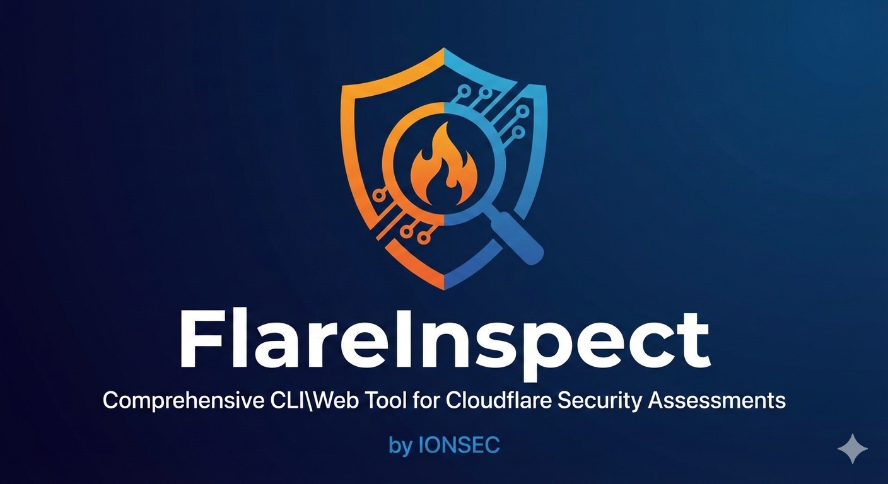

# FlareInspect

<div align="center">
  
  <p>Cloudflare security assessment CLI and local web dashboard</p>
</div>

## Overview

FlareInspect assesses Cloudflare accounts and zones, highlights security gaps, compares posture drift between runs, and exports evidence-rich reports for engineers, security teams, auditors, and CI pipelines.

The current `1.1.0` release includes:

- evidence-rich findings with named identities, affected resources, observed values, expected values, and review guidance
- drift detection with `flareinspect diff`
- compliance mapping for `cis`, `soc2`, `pci`, and `nist`
- contextual scoring and CI gate options
- exporters for `json`, `html`, `ocsf`, `sarif`, `markdown`, `csv`, and `asff`
- shared config file support
- local web APIs with optional header-based API key protection

## Key Features

- Cloudflare account and zone security assessments
- Evidence-rich findings for key controls such as MFA, admin access, audit logs, DNS, TLS, and WAF posture
- Detailed HTML and Markdown review sections including analysis and affected entities
- Drift detection between assessment runs with `flareinspect diff`
- Compliance mapping for `cis`, `soc2`, `pci`, and `nist`
- Contextual scoring and CI/CD gate support
- Export formats for `json`, `html`, `ocsf`, `sarif`, `markdown`, `csv`, and `asff`
- Local web dashboard with assessment history and report downloads
- Shared config file support for repeatable team workflows
- Docker and Render deployment support
- Plugin scaffold support for trusted local extensions

## Installation

### From source

```bash
git clone https://github.com/ionsec/flareinspect.git
cd flareinspect
npm install
```

### Docker

```bash
docker build -t flareinspect .
```

## Quick Start

```bash
# Run an assessment directly
node src/cli/index.js assess --token YOUR_TOKEN

# Export a saved assessment
node src/cli/index.js export -i assessment.json -f html -o report.html

# Compare two runs
node src/cli/index.js diff --baseline old.json --current new.json -f markdown -o drift.md

# Start the web dashboard
npm run web
```

## What The Reports Contain

FlareInspect reports are no longer limited to pass/fail summaries. Where the Cloudflare API returns the data, findings now include:

- named affected identities such as admins and members without MFA
- affected resources such as wildcard DNS records or misconfigured zones
- observed versus expected values
- structured counts used in the decision
- evidence source metadata
- review guidance for operators

The HTML and Markdown reports also include:

- `Detailed Findings Review`
- `Identity and Access Analysis`
- `Zone Exposure Analysis`
- `Transport and TLS Analysis`
- `Traffic Protection Analysis`
- `Logging and Forensics Analysis`

## Configuration

FlareInspect can load settings from:

- `.flareinspect.yml`
- `.flareinspect.yaml`
- `flareinspect.config.json`

Example:

```yaml
token: ${CLOUDFLARE_TOKEN}

output:
  format: json
  directory: ./output

assessment:
  concurrency: 4
  checks:
    - dns
    - ssl
    - waf
  excludeZones:
    - dev.example.com

compliance:
  framework: cis

scoring:
  sensitivity: high

ci:
  threshold: 80
  failOn: high
```

CLI flags override config file values.

## CLI Usage

### Assess

```bash
flareinspect assess --token YOUR_TOKEN
flareinspect assess --token YOUR_TOKEN --zones example.com,api.example.com
flareinspect assess --checks dns,ssl,waf --output report.json
flareinspect assess --compliance cis --sensitivity high
flareinspect assess --ci --threshold 80 --fail-on high
```

Important notes:

- `--checks` now filters validated assessment categories instead of being a no-op.
- `--zones` only assesses named zones visible to the supplied token.
- if your token can only enumerate one zone, the assessment will only cover that visible zone even if the account owns more elsewhere.

Supported `--checks` categories include:

- `account`
- `dns`
- `ssl`
- `waf`
- `zerotrust`
- `workers`
- `pages`
- `api`
- `bot`
- `logpush`
- `mtls`
- `securitytxt`
- `attack-surface`
- `dlp`
- `tunnels`
- `gateway`
- `page-shield`
- `cache`
- `snippets`
- `custom-hostnames`
- `ai-gateway`

### Export

```bash
flareinspect export -i assessment.json -f html -o report.html
flareinspect export -i assessment.json -f ocsf -o findings.ocsf.json
flareinspect export -i assessment.json -f sarif -o findings.sarif
flareinspect export -i assessment.json -f markdown -o report.md
flareinspect export -i assessment.json -f csv -o findings.csv
flareinspect export -i assessment.json -f asff -o findings.asff.json
```

### Diff

```bash
flareinspect diff --baseline previous.json --current current.json
flareinspect diff --baseline previous.json --current current.json -f markdown -o drift.md
```

## Output Formats

- `json`: native FlareInspect assessment output, including full findings, report model, and configuration snapshot
- `html`: human-readable report with detailed findings review and analysis sections
- `ocsf`: OCSF-oriented JSON document
- `sarif`: static-analysis style findings for code scanning tools
- `markdown`: lightweight review report suitable for tickets, PRs, and audit notes
- `csv`: flattened findings with evidence columns such as observed, expected, affected entities, and counts
- `asff`: AWS Security Finding Format for Security Hub style ingestion

## Web App

Start the dashboard:

```bash
npm run web
```

Optional environment variables:

- `HOST` default `127.0.0.1`
- `PORT` default auto-selected free port
- `FLAREINSPECT_API_KEY` to require `X-API-Key` on `/api/*`

Assessment data is stored in `web/data/assessments`.

API endpoints:

- `POST /api/assess`
- `GET /api/assessment`
- `GET /api/assessments`
- `GET /api/assessments/:id`
- `GET /api/compliance/:framework`
- `POST /api/diff`
- `GET /api/download/json`
- `GET /api/download/html`
- `GET /api/download/sarif`
- `GET /api/download/markdown`
- `GET /api/download/csv`
- `GET /api/download/asff`
- `GET /api/health`

Web API notes:

- API key authentication is header-only. Use `X-API-Key`.
- The server validates assessment IDs, framework names, concurrency values, and zone list sizes before processing requests.
- Unexpected server errors return generic responses rather than internal stack traces.

## Docker

Build and run the CLI:

```bash
docker build -t flareinspect .
docker run --rm -it flareinspect
docker run --rm -v $(pwd)/output:/app/output flareinspect \
  assess --token YOUR_TOKEN --output /app/output/assessment.json
```

Run the web app with Compose:

```bash
docker compose up flareinspect-web
```

The compose file exposes:

- `flareinspect` for CLI execution
- `flareinspect-web` for the dashboard
- `flareinspect-dev` for interactive development

## Security Notes

- Keep Cloudflare API tokens in environment variables or local config files that are not committed.
- When exposing the web API beyond localhost, set `FLAREINSPECT_API_KEY`.
- Assessment artifacts are stored locally in `web/data/assessments` or your chosen output directory; remove them when no longer needed.
- The plugin loader executes local plugin code by design. Treat plugins as a trusted-code boundary, not a sandbox.
- Verify the repo state with:

```bash
npm audit --omit=dev
npm test -- --runInBand
npm run lint
```

## Cloudflare API Permissions

Minimum useful coverage:

- `Zone:Read`
- `DNS:Read`
- `SSL and Certificates:Read`
- `Firewall Services:Read`
- `Account Settings:Read`

Recommended for broader coverage:

- `Access/Zero Trust:Read`
- `Workers Scripts:Read`
- `Audit Logs:Read`
- `Security Center:Read`
- `Logpush:Read`
- `API Gateway:Read`


## Development

```bash
npm install
npm test -- --runInBand
npm run lint
npm run dev
```

Helpful files:

- `src/cli/` for CLI commands
- `src/core/services/` for assessment, reporting, diff, compliance, and Cloudflare API logic
- `src/exporters/` for output format implementations
- `templates/report.html` for the HTML report template
- `web/` for the local dashboard and API
- `tests/` for regression coverage

## Contributing

External collaboration is supported. Start with [CONTRIBUTING.md](CONTRIBUTING.md).

Short version:

- open an issue before large changes
- keep changes focused and tested
- do not commit secrets, assessment artifacts, or private customer output
- run `npm test -- --runInBand` and `npm run lint` before opening a PR

## Issues

Bug reports and feature requests are welcome. Use the GitHub issue templates in `.github/ISSUE_TEMPLATE/` when opening a new issue.

High-signal issues should include:

- the exact command or API request used
- the FlareInspect version
- whether the run used CLI, Docker, or web mode
- a redacted sample assessment or relevant log/error output
- expected behavior versus actual behavior

## Troubleshooting

- `403` usually means the token is missing product-specific scopes or entitlements.
- `No matching zones found` means zone filters excluded everything or the token cannot see those zones.
- `Unknown check categories` means `--checks` included unsupported category names.
- `Unknown compliance framework` means the web or CLI request used a framework outside `cis`, `soc2`, `pci`, or `nist`.
- If an account appears to have fewer zones than expected, verify the token scope and which Cloudflare account or organization it can enumerate.

## License

MIT. See `LICENSE`.
