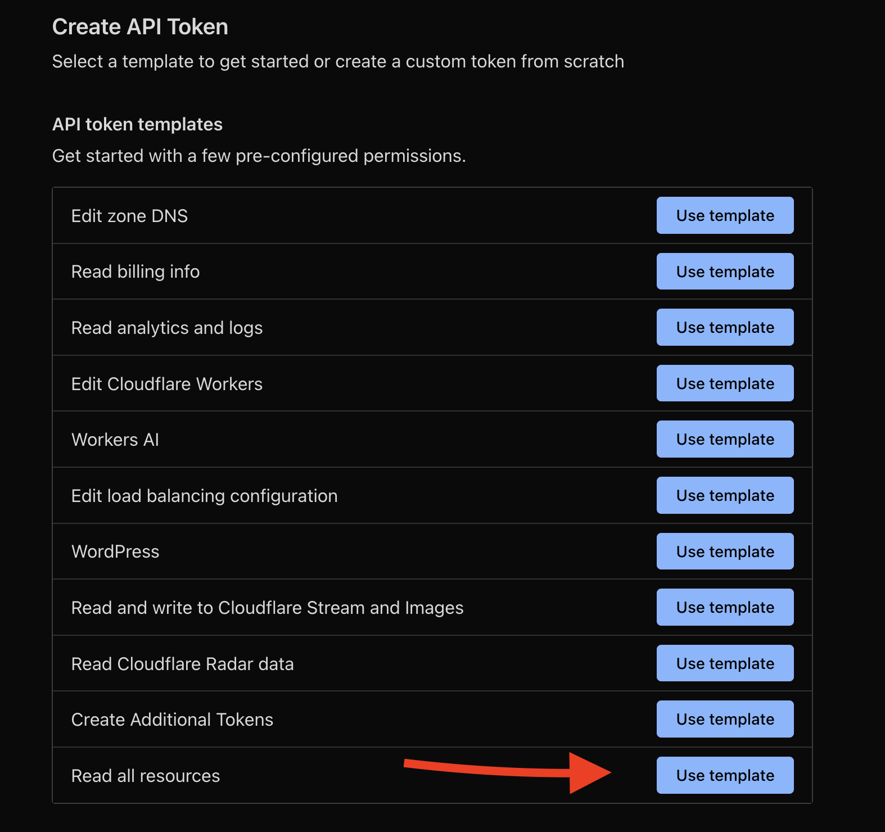

# Flare*Inspect*

<div align="center">
  
  <p><em>Cloudflare security assessment — CLI and local dashboard.</em></p>
  <p>
    <a href="https://github.com/ionsec/flareinspect/actions"></a>
    
    
    
  </p>
</div>

> **1.2.1** — new brand identity (flare-in-reticle mark + Manrope/Fraunces wordmark), redesigned web
> dashboard and HTML report, refreshed CLI banner, dropped the vulnerable `uuid` dependency in favor
> of `crypto.randomUUID()`. `npm audit` reports 0 vulnerabilities. See
> [`docs/changelog.rst`](docs/changelog.rst) for the full list.

## Overview

FlareInspect assesses Cloudflare accounts and zones, highlights security gaps, compares posture drift between runs, and exports evidence-rich reports for engineers, security teams, auditors, and CI pipelines.

The current `1.2.1` release includes:

- evidence-rich findings with named identities, affected resources, observed values, expected values, and review guidance
- drift detection with `flareinspect diff`
- compliance mapping for `cis`, `soc2`, `pci`, and `nist`
- contextual scoring and CI gate options
- exporters for `json`, `html`, `ocsf`, `sarif`, `markdown`, `csv`, and `asff`
- shared config file support
- local web APIs with optional header-based API key protection
- a redesigned dark dashboard (sidebar nav · score-ring hero · zone matrix) and HTML report (masthead · KPI strip · charts)
- new brand mark and CLI banner — flare-in-reticle, Manrope/Fraunces typography
- `0` open `npm audit` vulnerabilities, `inflight`/`glob@7`/`node-domexception` warnings cleared
- **full documentation at [flareinspect.readthedocs.io](https://flareinspect.readthedocs.io)**

## Brand

The mark is a flare burst held inside an inspection reticle — the lens at center is observation,
the eight rays are Cloudflare's edge. Same amber as the dashboard
(`oklch(72% 0.17 52)` / `#f6821f`). Wordmark uses Fraunces serif with italic *Inspect*; UI text
is Manrope; mono is Geist Mono.

| Asset | File | Use |
|---|---|---|
| Mark (open SVG, `currentColor`) | [`web/public/flare-inspect-logo.svg`](web/public/flare-inspect-logo.svg) | Inline UI, headers, README |
| Glyph (rounded-square, app icon) | [`web/public/flare-inspect-glyph.svg`](web/public/flare-inspect-glyph.svg) | Favicon, OS app icons, social previews |

## Key Features

- Cloudflare account and zone security assessments — 40+ checks across 21 categories
- Evidence-rich findings for key controls such as MFA, admin access, audit logs, DNS, TLS, and WAF posture
- Detailed HTML and Markdown review sections including analysis and affected entities
- Drift detection between assessment runs with `flareinspect diff`
- Compliance mapping for `cis`, `soc2`, `pci`, and `nist`
- Contextual scoring (CVSS-inspired) with CI/CD gate support
- Export formats for `json`, `html`, `ocsf`, `sarif`, `markdown`, `csv`, and `asff`
- Local web dashboard with assessment history, compliance reports, and report downloads
- Shared config file support (`.flareinspect.yml`, `.flareinspect.yaml`, `flareinspect.config.json`)
- 1-click cloud deployment to Render, Heroku, Railway, and Fly.io
- Plugin scaffold support for trusted local extensions

## Installation

### From source

```bash
git clone https://github.com/ionsec/flareinspect.git
cd flareinspect
npm install
```

### Docker

```bash
docker build -t flareinspect .
```

## Quick Start

```bash
# Run an assessment directly
node src/cli/index.js assess --token YOUR_TOKEN

# Export a saved assessment
node src/cli/index.js export -i assessment.json -f html -o report.html

# Compare two runs
node src/cli/index.js diff --baseline old.json --current new.json -f markdown -o drift.md

# Start the web dashboard
npm run web
```

## What The Reports Contain

FlareInspect reports are no longer limited to pass/fail summaries. Where the Cloudflare API returns the data, findings now include:

- named affected identities such as admins and members without MFA
- affected resources such as wildcard DNS records or misconfigured zones
- observed versus expected values
- structured counts used in the decision
- evidence source metadata
- review guidance for operators

The HTML and Markdown reports also include:

- `Detailed Findings Review`
- `Identity and Access Analysis`
- `Zone Exposure Analysis`
- `Transport and TLS Analysis`
- `Traffic Protection Analysis`
- `Logging and Forensics Analysis`

## Security Checks

FlareInspect runs 40+ security checks across 21 categories:

| Category | Checks | Key Areas |
|----------|--------|------------|
| Account | 5 | MFA, admin access, audit logs, token security |
| DNS | 5 | DNSSEC, proxy status, wildcards, CAA, DoH |
| SSL/TLS | 5 | SSL mode, TLS version, HSTS, cert validity |
| WAF | 5 | Security level, custom rules, rate limiting, OWASP |
| Zero Trust | 6+ | IdP, access policies, device enrollment, tunnels, gateway |
| Workers & Pages | 4 | Route security, resource limits, deployment protection |
| API Gateway | 2 | API Shield, API Discovery |
| Bot Management | 2 | Bot Fight Mode, Turnstile |
| Email Security | 3 | Routing, SPF/DKIM/DMARC, encryption |
| Attack Surface | 7 | Security Center, exposed credentials, origin IP exposure |
| Modern Features | 9+ | DLP, Page Shield, AI Gateway, Cache Deception, Snippets, Tunnels, Gateway, Custom Hostnames, Origin Certs |
| and more | | Logpush, mTLS, security.txt, Load Balancing |

See the [full check catalog](https://flareinspect.readthedocs.io/en/latest/checks/) for every check ID, severity, compliance mapping, and remediation guidance.

## Configuration

FlareInspect can load settings from:

- `.flareinspect.yml`
- `.flareinspect.yaml`
- `flareinspect.config.json`

Example:

```yaml
token: ${CLOUDFLARE_TOKEN}

output:
  format: json
  directory: ./output

assessment:
  concurrency: 4
  checks:
    - dns
    - ssl
    - waf
  excludeZones:
    - dev.example.com

compliance:
  framework: cis

scoring:
  sensitivity: high

ci:
  threshold: 80
  failOn: high
```

CLI flags override config file values. See [Configuration Docs](https://flareinspect.readthedocs.io/en/latest/configuration/config-file/) for details.

## CLI Usage

### Assess

```bash
flareinspect assess --token YOUR_TOKEN
flareinspect assess --token YOUR_TOKEN --zones example.com,api.example.com
flareinspect assess --checks dns,ssl,waf --output report.json
flareinspect assess --compliance cis --sensitivity high
flareinspect assess --ci --threshold 80 --fail-on high
```

Supported `--checks` categories include:

`account` · `dns` · `ssl` · `waf` · `zerotrust` · `workers` · `pages` · `api` · `bot` · `logpush` · `mtls` · `securitytxt` · `attack-surface` · `dlp` · `tunnels` · `gateway` · `page-shield` · `cache` · `snippets` · `custom-hostnames` · `ai-gateway`

### Export

```bash
flareinspect export -i assessment.json -f html -o report.html
flareinspect export -i assessment.json -f ocsf -o findings.ocsf.json
flareinspect export -i assessment.json -f sarif -o findings.sarif
flareinspect export -i assessment.json -f markdown -o report.md
flareinspect export -i assessment.json -f csv -o findings.csv
flareinspect export -i assessment.json -f asff -o findings.asff.json
```

### Diff

```bash
flareinspect diff --baseline previous.json --current current.json
flareinspect diff --baseline previous.json --current current.json -f markdown -o drift.md
```

## Compliance Mapping

Map findings to industry frameworks:

```bash
flareinspect assess --token $TOKEN --compliance cis
flareinspect assess --token $TOKEN --compliance soc2
flareinspect assess --token $TOKEN --compliance pci
flareinspect assess --token $TOKEN --compliance nist
```

Each framework produces a report with control mappings, pass rates, and overall scores. See [Compliance Docs](https://flareinspect.readthedocs.io/en/latest/compliance/).

## Contextual Scoring

Adjust severity based on zone plan, exposure, and data sensitivity:

```bash
flareinspect assess --token $TOKEN --sensitivity critical
```

| Plan | Multiplier | Sensitivity | Multiplier |
|------|-----------|-------------|-----------|
| Free | 1.3× | Critical (PII, financial) | 1.5× |
| Pro | 1.1× | High (business-sensitive) | 1.3× |
| Business | 1.0× | Medium (standard) | 1.0× |
| Enterprise | 0.9× | Low (public info) | 0.8× |

## Output Formats

| Format | Best For |
|--------|----------|
| `json` | Programmatic access, re-import, full fidelity |
| `html` | Human review, management reporting, interactive charts |
| `ocsf` | SIEM ingestion, OCSF-compliant pipelines |
| `sarif` | GitHub Code Scanning, static analysis tools |
| `markdown` | Tickets, PRs, audit notes, wikis |
| `csv` | Spreadsheet analysis, filtered evidence review |
| `asff` | AWS Security Hub, Security Finding Format pipelines |

## Web Dashboard

A local dark-themed dashboard with sidebar navigation (Overview · Run · Findings · Compliance ·
History · Exports · Report · API Health). The Overview hero shows a radial score ring,
per-category breakdown bars, an open-findings severity strip, a four-framework compliance rail,
top failing findings, and a per-zone posture matrix.

Start the dashboard:

```bash
npm run web
```

Optional environment variables:

- `HOST` default `127.0.0.1`
- `PORT` default auto-selected free port
- `FLAREINSPECT_API_KEY` to require `X-API-Key` on `/api/*`

Assessment data is stored in `web/data/assessments`.

API endpoints:

| Method | Endpoint | Description |
|--------|----------|-------------|
| POST | `/api/assess` | Run a new assessment |
| GET | `/api/assessment` | Get latest assessment |
| GET | `/api/assessments` | List assessment history |
| GET | `/api/assessments/:id` | Get assessment by ID |
| GET | `/api/compliance/:framework` | Get compliance report (cis/soc2/pci/nist) |
| POST | `/api/diff` | Compare two assessments |
| GET | `/api/download/json` | Download JSON |
| GET | `/api/download/html` | Download HTML report |
| GET | `/api/download/sarif` | Download SARIF |
| GET | `/api/download/markdown` | Download Markdown |
| GET | `/api/download/csv` | Download CSV |
| GET | `/api/download/asff` | Download ASFF |
| GET | `/api/health` | Health check |

See the [API Reference](https://flareinspect.readthedocs.io/en/latest/web-dashboard/api-reference/) for full details.

## Deployment

### Cloud (1-Click)

| Platform | Button | Notes |
|----------|--------|-------|
| Render (recommended) | [](https://render.com/deploy?repo=https://github.com/ionsec/flareinspect) | Free tier · 1 GB persistent storage |
| Heroku | [](https://heroku.com/deploy?template=https://github.com/ionsec/flareinspect) | ~$5/month Hobby dyno |
| Railway | [](https://railway.app/template/flareinspect) | $5 trial credit |
| Fly.io | See [DEPLOYMENT.md](DEPLOYMENT.md#flyio) | Free allowance · edge regions |

After deployment, set environment variables in the platform dashboard:

```
CLOUDFLARE_TOKEN=your_token          # optional — can supply via UI
FLAREINSPECT_API_KEY=<random-secret> # protects the dashboard
```

See [DEPLOYMENT.md](DEPLOYMENT.md) for full instructions including Kubernetes and self-hosting.

### Docker

Build and run the CLI:

```bash
docker build -t flareinspect .
docker run --rm -it flareinspect
docker run --rm -v $(pwd)/output:/app/output flareinspect \
  assess --token YOUR_TOKEN --output /app/output/assessment.json
```

Run the web dashboard with Compose:

```bash
docker compose up flareinspect-web
```

The compose file exposes:

- `flareinspect` for CLI execution
- `flareinspect-web` for the dashboard at `http://localhost:3000`
- `flareinspect-dev` for interactive development

## CI/CD Integration

Use FlareInspect in CI pipelines to gate deployments on security posture:

```yaml
# GitHub Actions example
- name: Cloudflare Security Assessment
  run: |
    node src/cli/index.js assess --token ${{ secrets.CLOUDFLARE_TOKEN }} \
      --ci --threshold 80 --fail-on high
```

See [CI/CD Docs](https://flareinspect.readthedocs.io/en/latest/ci-cd/github-actions/) for GitHub Actions, GitLab CI, and exit code details.

## Security Notes

- Keep Cloudflare API tokens in environment variables or local config files that are not committed.
- When exposing the web API beyond localhost, set `FLAREINSPECT_API_KEY`.
- Assessment artifacts are stored locally in `web/data/assessments` or your chosen output directory; remove them when no longer needed.
- The plugin loader executes local plugin code by design. Treat plugins as a trusted-code boundary, not a sandbox.
- Verify the repo state with:

```bash
npm audit --omit=dev
npm test -- --runInBand
npm run lint
```

## Cloudflare API Permissions

Minimum useful coverage:

- `Zone:Read`
- `DNS:Read`
- `SSL and Certificates:Read`
- `Firewall Services:Read`
- `Account Settings:Read`

Recommended for broader coverage:

- `Access/Zero Trust:Read`
- `Workers Scripts:Read`
- `Audit Logs:Read`
- `Security Center:Read`
- `Logpush:Read`
- `API Gateway:Read`



## Documentation

Full documentation is available at [flareinspect.readthedocs.io](https://flareinspect.readthedocs.io):

- [Getting Started](https://flareinspect.readthedocs.io/en/latest/getting-started/) — Run your first assessment
- [CLI Reference](https://flareinspect.readthedocs.io/en/latest/cli/assess/) — All commands and options
- [Security Checks](https://flareinspect.readthedocs.io/en/latest/checks/) — Full check catalog with remediation
- [Export Formats](https://flareinspect.readthedocs.io/en/latest/export-formats/) — JSON, HTML, OCSF, SARIF, Markdown, CSV, ASFF
- [Compliance Mapping](https://flareinspect.readthedocs.io/en/latest/compliance/) — CIS, SOC 2, PCI-DSS, NIST CSF
- [Drift Detection](https://flareinspect.readthedocs.io/en/latest/drift-detection/) — Compare assessments for regressions
- [Web Dashboard](https://flareinspect.readthedocs.io/en/latest/web-dashboard/) — API reference and authentication
- [CI/CD Integration](https://flareinspect.readthedocs.io/en/latest/ci-cd/github-actions/) — GitHub Actions and GitLab CI
- [Deployment](https://flareinspect.readthedocs.io/en/latest/deployment/) — Docker, Render, Heroku, Railway, Fly.io
- [Architecture](https://flareinspect.readthedocs.io/en/latest/architecture/overview/) — Data flow and module map
- [Plugin Development](https://flareinspect.readthedocs.io/en/latest/plugins/writing-plugins/) — Extend FlareInspect

## Development

```bash
npm install
npm test -- --runInBand
npm run lint
npm run dev
```

Helpful files:

- `src/cli/` for CLI commands
- `src/core/services/` for assessment, reporting, diff, compliance, and Cloudflare API logic
- `src/exporters/` for output format implementations
- `templates/report.html` for the HTML report template (V1 design)
- `web/public/{index.html,styles.css,app.js}` for the dashboard SPA
- `web/public/{flare-inspect-logo,flare-inspect-glyph}.svg` for the brand assets
- `web/` for the local dashboard and API
- `tests/` for regression coverage
- `docs/` for the MkDocs documentation source

## Contributing

External collaboration is supported. Start with [CONTRIBUTING.md](CONTRIBUTING.md).

Short version:

- open an issue before large changes
- keep changes focused and tested
- do not commit secrets, assessment artifacts, or private customer output
- run `npm test -- --runInBand` and `npm run lint` before opening a PR

## Issues

Bug reports and feature requests are welcome. Use the GitHub issue templates in `.github/ISSUE_TEMPLATE/` when opening a new issue.

High-signal issues should include:

- the exact command or API request used
- the FlareInspect version
- whether the run used CLI, Docker, or web mode
- a redacted sample assessment or relevant log/error output
- expected behavior versus actual behavior

## Troubleshooting

- `403` usually means the token is missing product-specific scopes or entitlements.
- `No matching zones found` means zone filters excluded everything or the token cannot see those zones.
- `Unknown check categories` means `--checks` included unsupported category names.
- `Unknown compliance framework` means the web or CLI request used a framework outside `cis`, `soc2`, `pci`, or `nist`.
- If an account appears to have fewer zones than expected, verify the token scope and which Cloudflare account or organization it can enumerate.

## License

MIT. See `LICENSE`.
