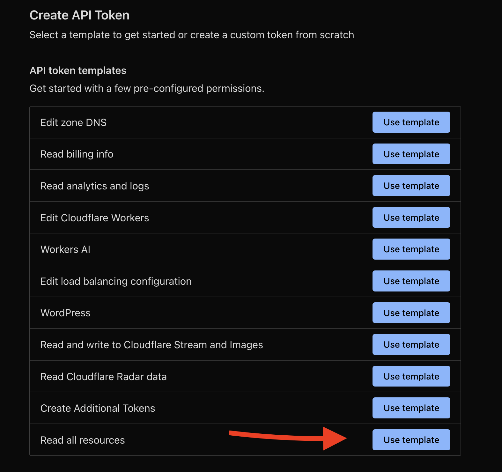

# Flare*Inspect*

<div align="center">
  
  <p><em>Cloudflare security assessment — CLI and local dashboard.</em></p>
  <p>
    <a href="https://github.com/ionsec/flareinspect/actions"></a>
    
    
    
  </p>
</div>

> **2.0.0** — resource graph + attack-path engine, dashboard **Posture
> map** (entity graph + attack paths), Elasticsearch & Splunk HEC
> shippers, MCP server (stdio) for AI agents, Slack/Teams/webhook
> notifications, and 13 new check categories.  See
> [`CHANGELOG.md`](CHANGELOG.md) for the full list.

## Overview

FlareInspect assesses Cloudflare accounts and zones, highlights security gaps, compares posture drift between runs, and exports evidence-rich reports for engineers, security teams, auditors, and CI pipelines.

The current `2.0.0` release includes everything in `1.3.0` plus:

- **Resource graph** — typed node/edge view of the account (14 node types, 8 edge types) as the single source of truth
- **Attack-path engine** — 5 rule-based detectors (`exposed-origin`, `weak-transport`, `open-access-app`, `tunnel-without-access`, `worker-plaintext-secret`)
- **Posture map** — interactive entity graph in the dashboard, with attack-path highlight and side-drawer findings
- **SIEM shipping** — `flareinspect ship` to Elasticsearch (ECS) or Splunk HEC, with attack-path enrichment
- **MCP server** — `flareinspect-mcp` (stdio) exposes the engine to any MCP-aware agent
- **Notifications** — `flareinspect notify` to Slack (Block Kit), Teams (Adaptive Card 1.5), or HMAC-signed webhooks
- **Packaged Kibana & Splunk apps** — saved-objects bundle and TA tuned to the shipped payloads
- **13 new check categories** — credentials, notifications, ddos, account-waf, workers, storage, zaraz, posture, access, casb, email-security, rbi, magic

- evidence-rich findings with named identities, affected resources, observed values, expected values, and review guidance
- drift detection with `flareinspect diff`
- compliance mapping for `cis`, `soc2`, `pci`, and `nist`
- contextual scoring and CI gate options
- exporters for `json`, `html`, `ocsf`, `sarif`, `markdown`, `csv`, and `asff`
- shared config file support
- local web APIs with optional header-based API key protection
- a redesigned dark dashboard (sidebar nav · score-ring hero · zone matrix) and HTML report (masthead · KPI strip · charts)
- new brand mark and CLI banner — flare-in-reticle, Manrope/Fraunces typography
- `0` open `npm audit` vulnerabilities, `inflight`/`glob@7`/`node-domexception` warnings cleared
- **full documentation at [flareinspect.readthedocs.io](https://flareinspect.readthedocs.io)**

## Brand

The mark is a flare burst held inside an inspection reticle — the lens at center is observation,
the eight rays are Cloudflare's edge. Same amber as the dashboard
(`oklch(72% 0.17 52)` / `#f6821f`). Wordmark uses Fraunces serif with italic *Inspect*; UI text
is Manrope; mono is Geist Mono.

| Asset | File | Use |
|---|---|---|
| Mark (open SVG, `currentColor`) | [`web/public/flare-inspect-logo.svg`](web/public/flare-inspect-logo.svg) | Inline UI, headers, README |
| Glyph (rounded-square, app icon) | [`web/public/flare-inspect-glyph.svg`](web/public/flare-inspect-glyph.svg) | Favicon, OS app icons, social previews |

## Key Features

- Cloudflare account and zone security assessments — 50+ checks across 34 categories
- **Resource graph** — typed node/edge view of the account (14 node types, 8 edge types)
- **Attack-path engine** — 5 rule-based detectors that connect findings into chains of exposure
- **Posture map** — interactive entity graph in the dashboard, with attack-path highlight
- **SIEM shipping** — `flareinspect ship` to Elasticsearch (ECS) or Splunk HEC, with attack-path enrichment; packaged Kibana + Splunk apps
- **MCP server** — `flareinspect-mcp` (stdio) exposes the engine to any MCP-aware agent
- **Notifications** — `flareinspect notify` to Slack (Block Kit), Teams (Adaptive Card 1.5), or HMAC-signed webhooks
- Evidence-rich findings for key controls such as MFA, admin access, audit logs, DNS, TLS, and WAF posture
- Detailed HTML and Markdown review sections including analysis and affected entities
- Drift detection between assessment runs with `flareinspect diff`
- Compliance mapping for `cis`, `soc2`, `pci`, and `nist`
- Contextual scoring (CVSS-inspired) with CI/CD gate support
- Export formats for `json`, `html`, `ocsf`, `sarif`, `markdown`, `csv`, `asff`, `ecs`, and `splunk-hec`
- Local web dashboard with assessment history, compliance reports, posture map, and report downloads
- Shared config file support (`.flareinspect.yml`, `.flareinspect.yaml`, `flareinspect.config.json`)
- 1-click cloud deployment to Render, Heroku, Railway, and Fly.io
- Plugin scaffold support for trusted local extensions

## Installation

### From source

```bash
git clone https://github.com/ionsec/flareinspect.git
cd flareinspect
npm install
```

### Docker

```bash
docker build -t flareinspect .
```

## Quick Start

```bash
# Run an assessment directly
node src/cli/index.js assess --token YOUR_TOKEN

# Export a saved assessment
node src/cli/index.js export -i assessment.json -f html -o report.html

# Compare two runs
node src/cli/index.js diff --baseline old.json --current new.json -f markdown -o drift.md

# Start the web dashboard
npm run web
```

### v2.0 quick tour

```bash
# Visualise the resource graph + attack paths in the dashboard
#  — open http://localhost:3000/posture after an assessment runs

# Ship findings to Elasticsearch (ECS, with attack-path enrichment)
flareinspect ship -i assessment.json --target elastic \
  --es-url https://es.example.com --es-api-key $ES_KEY

# Ship to Splunk HEC instead (or both with --target all)
flareinspect ship -i assessment.json --target splunk \
  --hec-url https://splunk.example.com:8088 --hec-token $HEC_TOKEN

# Pull / air-gapped: write NDJSON to disk instead of POSTing
flareinspect ship -i assessment.json --target file --out-dir ./out

# Push a summary to Slack / Teams / webhook
flareinspect notify -i assessment.json --target all

# Let an MCP-aware agent drive the full assess -> plan -> apply loop
npx -y flareinspect-mcp
```

## What The Reports Contain

FlareInspect reports are no longer limited to pass/fail summaries. Where the Cloudflare API returns the data, findings now include:

- named affected identities such as admins and members without MFA
- affected resources such as wildcard DNS records or misconfigured zones
- observed versus expected values
- structured counts used in the decision
- evidence source metadata
- review guidance for operators

The HTML and Markdown reports also include:

- `Detailed Findings Review`
- `Identity and Access Analysis`
- `Zone Exposure Analysis`
- `Transport and TLS Analysis`
- `Traffic Protection Analysis`
- `Logging and Forensics Analysis`

## Security Checks

FlareInspect runs 50+ security checks across 34 categories:

| Category | Key Areas |
|----------|-----------|
| Account | MFA, admin access, audit logs, token security |
| Account WAF | Account-scope WAF / DDoS coverage |
| Access | Allow-everyone, MFA, session duration, posture gating |
| API Gateway | API Shield, API Discovery |
| Attack Surface | Security Center, exposed credentials, origin IP exposure |
| Bot Management | Bot Fight Mode, Turnstile |
| Cache | Cache Deception Armor, email obfuscation |
| CASB | Open critical/high CASB findings |
| Credentials | Leaked credentials detection |
| Custom Hostnames | Custom hostname security |
| DDoS | L7 DDoS posture |
| DLP | Data Loss Prevention policies |
| DNS | DNSSEC, proxy status, wildcards, CAA, DoH |
| Email | Routing, SPF/DKIM/DMARC |
| Email Security | Cloud Email Security policies |
| Gateway | Secure Web Gateway policies |
| Load Balancing | LB posture |
| Logpush | Log push destination and coverage |
| Magic | Magic Firewall / Magic Transit |
| mTLS | Mutual TLS authentication |
| Notifications | 4 security notification types (account-scoped) |
| Page Shield | Page Shield script monitoring |
| Pages | Cloudflare Pages deployment security |
| Performance | Brotli, HTTP/2-3, Email Obfuscation |
| Posture | Device posture rules |
| RBI | Browser Isolation policies |
| Rules | Rules / rate-limit rules |
| Security Insights | Security Center insights |
| security.txt | RFC 9116 presence and validity |
| Snippets | Cache and transform snippets |
| Spectrum | Spectrum (TCP/UDP) configuration |
| SSL/TLS | SSL mode, TLS version, HSTS, cert validity |
| Storage | Workers KV / D1 / Queues inventory |
| Turnstile | Turnstile configuration |
| Tunnels | Cloudflare Tunnels configuration |
| WAF | Security level, custom rules, rate limiting, OWASP, managed rulesets |
| Workers | Script inventory, plaintext-secret bindings, routes |
| Zaraz | Third-party tools and consent |
| Zero Trust | IdP, access policies, device enrollment, tunnels, gateway |
| AI Gateway | AI Gateway security configuration |

See the [full check catalog](https://flareinspect.readthedocs.io/en/latest/checks/) for every check ID, severity, compliance mapping, and remediation guidance.

## Configuration

FlareInspect can load settings from:

- `.flareinspect.yml`
- `.flareinspect.yaml`
- `flareinspect.config.json`

Example:

```yaml
token: ${CLOUDFLARE_TOKEN}

output:
  format: json
  directory: ./output

assessment:
  concurrency: 4
  checks:
    - dns
    - ssl
    - waf
  excludeZones:
    - dev.example.com

compliance:
  framework: cis

scoring:
  sensitivity: high

ci:
  threshold: 80
  failOn: high
```

CLI flags override config file values. See [Configuration Docs](https://flareinspect.readthedocs.io/en/latest/configuration/config-file/) for details.

## CLI Usage

### Assess

```bash
flareinspect assess --token YOUR_TOKEN
flareinspect assess --token YOUR_TOKEN --zones example.com,api.example.com
flareinspect assess --checks dns,ssl,waf --output report.json
flareinspect assess --compliance cis --sensitivity high
flareinspect assess --ci --threshold 80 --fail-on high
```

Supported `--checks` categories include (34 total):

`account` · `account-waf` · `access` · `ai-gateway` · `api` · `attack-surface` · `bot` · `cache` · `casb` · `credentials` · `custom-hostnames` · `ddos` · `dlp` · `dns` · `email` · `email-security` · `gateway` · `loadbalancing` · `logpush` · `magic` · `mtls` · `notifications` · `page-shield` · `pages` · `performance` · `posture` · `rbi` · `rules` · `security-insights` · `securitytxt` · `snippets` · `spectrum` · `ssl` · `storage` · `tunnels` · `turnstile` · `waf` · `workers` · `zaraz` · `zerotrust`

### Export

```bash
flareinspect export -i assessment.json -f html -o report.html
flareinspect export -i assessment.json -f ocsf -o findings.ocsf.json
flareinspect export -i assessment.json -f sarif -o findings.sarif
flareinspect export -i assessment.json -f markdown -o report.md
flareinspect export -i assessment.json -f csv -o findings.csv
flareinspect export -i assessment.json -f asff -o findings.asff.json
```

### Diff

```bash
flareinspect diff --baseline previous.json --current current.json
flareinspect diff --baseline previous.json --current current.json -f markdown -o drift.md
```

### Ship *(v2.0)*

Push an assessment to **Elasticsearch** (ECS 8.11.0) or **Splunk HEC**,
or write the same NDJSON to disk for air-gapped SIEM replay.  Every
shipped event is enriched with its resource-graph node and every
attack path it participates in, so SIEM rules can alert on *paths*,
not just findings.

```bash
# Live ship to Elasticsearch
flareinspect ship -i assessment.json --target elastic \
  --es-url https://es.example.com --es-api-key $ES_KEY

# Live ship to Splunk HEC
flareinspect ship -i assessment.json --target splunk \
  --hec-url https://splunk.example.com:8088 --hec-token $HEC_TOKEN

# Both in one call
flareinspect ship -i assessment.json --target all \
  --es-url ... --es-api-key ... --hec-url ... --hec-token ...

# Pull / air-gapped: write NDJSON to a directory (ECS + HEC + index template)
flareinspect ship -i assessment.json --target file --out-dir ./out

# Dry-run: print the payload, do not POST
flareinspect ship -i assessment.json --target elastic --es-url ... --es-api-key ... --dry-run
```

Env-var fallbacks: `FLAREINSPECT_ES_URL` / `_ES_APIKEY` /
`_ES_USERNAME` / `_ES_PASSWORD` and
`FLAREINSPECT_SPLUNK_HEC_URL` / `_HEC_TOKEN`.  Flags take precedence.

The **packaged Kibana** saved-objects bundle
(`integrations/elastic/flareinspect-dashboard.ndjson`) and the
**packaged Splunk TA** (`integrations/splunk/TA-flareinspect/`) are
tuned to the same payload — import them, then ship.

### Notify *(v2.0)*

Dispatch a summary to **Slack** (Block Kit), **Microsoft Teams**
(Adaptive Card 1.5), or a **generic webhook** (HMAC-SHA256-signed
with `X-FlareInspect-Signature`).

```bash
# All enabled channels
flareinspect notify -i assessment.json --target all

# Single channel
flareinspect notify -i assessment.json --target slack \
  --slack https://hooks.slack.com/services/T0/B0/XXX
flareinspect notify -i assessment.json --target teams \
  --teams https://prod-XX.logic.azure.com/.../invoke
flareinspect notify -i assessment.json --target webhook \
  --webhook https://ops.example.com/hooks/flareinspect \
  --secret "$(openssl rand -hex 32)"

# Only notify when there is a critical or high finding
flareinspect notify -i assessment.json --target all --threshold high
```

Env-var fallbacks: `FLAREINSPECT_SLACK_WEBHOOK`,
`FLAREINSPECT_TEAMS_WEBHOOK`, `FLAREINSPECT_WEBHOOK_URL`,
`FLAREINSPECT_WEBHOOK_SECRET`.

### MCP server *(v2.0)*

`flareinspect-mcp` exposes the engine to any MCP-aware agent
(Claude Code, Cowork, Hermes, OpenClaw) over **stdio**.  Six tools:
`flareinspect_assess`, `flareinspect_list_findings`,
`flareinspect_get_attack_paths`, `flareinspect_plan_remediation`,
`flareinspect_apply_remediation` *(gated)*, `flareinspect_rollback`
*(gated)*.

```bash
# Start the server (SDK is an optional dep)
node mcp/server.mjs
# …or
npx -y flareinspect-mcp
```

Register it in your client's MCP config (Claude Code example, in
`.mcp.json`):

```json
{
  "mcpServers": {
    "flareinspect": {
      "command": "node",
      "args": ["/absolute/path/to/flareinspect/mcp/server.mjs"],
      "env": { "FLAREINSPECT_ALLOW_REMEDIATION": "true" }
    }
  }
}
```

The two gated tools require both `FLAREINSPECT_ALLOW_REMEDIATION=true`
*and* a token that satisfies `verifyEditScope` — an opaque env-bound
secret (`FLAREINSPECT_EDIT_SCOPE`) or a JWT with `permission: 'edit'`.
See the [MCP edit-scope policy](https://flareinspect.readthedocs.io/en/latest/mcp/edit-scope/)
for the full matrix.

### Remediate (AI-assisted, safety-first)

Close the loop: automatically fix the safely-fixable findings from an assessment. The
design is deliberately conservative:

- **Dry-run by default.** `plan` shows the proposed before→after diff and writes a
  backup, but changes nothing. You must pass `--apply` to mutate Cloudflare.
- **Backup before *and* after.** Every run writes a checksum-protected rollback bundle;
  the "before" snapshot is persisted before any change, so a crash never loses it.
- **Reversible-only.** Only single-setting, idempotent, reversible flips are
  auto-applied (SSL mode, min TLS, Always-HTTPS, HSTS, security level, DNSSEC,
  Brotli/HTTP2/HTTP3, Cache Deception Armor). Findings like MFA, exposed credentials,
  or code changes are surfaced as **manual-only** and never auto-applied.
- **AI never invents changes.** The optional AI planner only *orders and annotates* the
  fixed recipe catalog; it cannot add endpoints or payloads. With no AI configured it
  falls back to deterministic rules-only ordering.

```bash
# 1. Dry-run: review proposed changes + write a backup, mutate nothing
flareinspect remediate plan -i assessment.json --token $TOKEN

# 2. Apply (requires --apply; high-risk changes need confirmation or --force)
flareinspect remediate apply -i assessment.json --token $TOKEN --apply

# 3. Roll back from a backup bundle
flareinspect remediate rollback --backup ./remediation-backups/<bundle>.backup.json --token $TOKEN
```

> **Token permissions — important.** FlareInspect's assessment is intentionally
> **read-only**: `assess` only needs `Zone:Read`, `DNS:Read`, `SSL and Certificates:Read`.
> **Remediation writes config**, so `remediate apply` requires a *different*, edit-scoped
> token — your assessment token will not work for apply. Create a token at
> dash.cloudflare.com → My Profile → API Tokens with:
>
> - **Zone → Zone Settings → Edit** (SSL mode, TLS, HSTS, security level, Brotli, HTTP/2-3, Cache Deception Armor)
> - **Zone → DNS → Edit** (DNSSEC)
> - **Zone → Zone → Read** (to enumerate zones)
>
> Keep the read-only token for scheduled assessments and use the edit-scoped token only
> when you intend to apply fixes.

Enable the AI planner by setting `ai.provider` in config (or `--ai-provider`):

- **`anthropic`** / **`openai`** — cloud models; key via `ANTHROPIC_API_KEY` / `OPENAI_API_KEY`.
  The SDKs (`@anthropic-ai/sdk`, `openai`) are optional dependencies.
- **`ollama`** (a.k.a. `local`) — a fully offline local model via [Ollama](https://ollama.com).
  No key, no SDK; talks to `http://localhost:11434` (override with `--ai-base-url` or
  `OLLAMA_HOST`). Example: `--ai-provider ollama --ai-model llama3.1`.
- **`none`** — deterministic rules-only ordering (the default).

In every case the AI only *orders and annotates* the fixed recipe catalog; it can never
invent a change. If the model/server is unavailable, remediation degrades cleanly to
rules-only ordering.

In the **web dashboard**, the Remediate page mirrors this flow (plan → review diff →
apply → rollback). Apply/rollback are disabled unless the server is started with
`FLAREINSPECT_ALLOW_REMEDIATION=true`.

## Compliance Mapping

Map findings to industry frameworks:

```bash
flareinspect assess --token $TOKEN --compliance cis
flareinspect assess --token $TOKEN --compliance soc2
flareinspect assess --token $TOKEN --compliance pci
flareinspect assess --token $TOKEN --compliance nist
```

Each framework produces a report with control mappings, pass rates, and overall scores. See [Compliance Docs](https://flareinspect.readthedocs.io/en/latest/compliance/).

## Contextual Scoring

Adjust severity based on zone plan, exposure, and data sensitivity:

```bash
flareinspect assess --token $TOKEN --sensitivity critical
```

| Plan | Multiplier | Sensitivity | Multiplier |
|------|-----------|-------------|-----------|
| Free | 1.3× | Critical (PII, financial) | 1.5× |
| Pro | 1.1× | High (business-sensitive) | 1.3× |
| Business | 1.0× | Medium (standard) | 1.0× |
| Enterprise | 0.9× | Low (public info) | 0.8× |

## Output Formats

| Format | Best For |
|--------|----------|
| `json` | Programmatic access, re-import, full fidelity |
| `html` | Human review, management reporting, interactive charts |
| `ocsf` | SIEM ingestion, OCSF-compliant pipelines |
| `sarif` | GitHub Code Scanning, static analysis tools |
| `markdown` | Tickets, PRs, audit notes, wikis |
| `csv` | Spreadsheet analysis, filtered evidence review |
| `asff` | AWS Security Hub, Security Finding Format pipelines |
| `ecs` | Elasticsearch `_bulk` NDJSON (v2.0; same shape as `flareinspect ship --target elastic`) |
| `splunk-hec` | Splunk HEC envelopes (v2.0; same shape as `flareinspect ship --target splunk`) |

## Web Dashboard

A local dark-themed dashboard with sidebar navigation (Overview · Run · **Posture map** · Findings · Compliance ·
History · Exports · Report · Remediate · API Health). The Overview hero shows a radial score ring,
per-category breakdown bars, an open-findings severity strip, a four-framework compliance rail,
top failing findings, and a per-zone posture matrix. The **Posture map** page (v2.0) renders the
resource graph and attack paths as an interactive entity graph with pan/zoom, hover neighbour
focus, and a click-to-open side-drawer with sorted findings.

Start the dashboard:

```bash
npm run web
```

Optional environment variables:

- `HOST` default `127.0.0.1`
- `PORT` default auto-selected free port
- `FLAREINSPECT_API_KEY` to require `X-API-Key` on `/api/*`
- `FLAREINSPECT_ALLOW_REMEDIATION` set to `true` to enable the apply/rollback endpoints (off by default)
- `FLAREINSPECT_EDIT_SCOPE` opaque secret for `verifyEditScope` (the edit-scope token check)
- `FLAREINSPECT_ES_URL` / `FLAREINSPECT_ES_APIKEY` defaults for `/api/integrations/ship`
- `FLAREINSPECT_SPLUNK_HEC_URL` / `FLAREINSPECT_SPLUNK_HEC_TOKEN` defaults for HEC shipping
- `FLAREINSPECT_SLACK_WEBHOOK` / `FLAREINSPECT_TEAMS_WEBHOOK` / `FLAREINSPECT_WEBHOOK_URL` / `FLAREINSPECT_WEBHOOK_SECRET` defaults for `/api/notify`
- `ANTHROPIC_API_KEY` / `OPENAI_API_KEY` to enable the optional AI remediation planner

Assessment data is stored in `web/data/assessments`.

API endpoints:

| Method | Endpoint | Description |
|--------|----------|-------------|
| POST | `/api/assess` | Run a new assessment |
| GET | `/api/assessment` | Get latest assessment |
| GET | `/api/assessments` | List assessment history |
| GET | `/api/assessments/:id` | Get assessment by ID |
| GET | `/api/posture/graph` | **v2.0** — resource graph + attack paths for an assessment |
| POST | `/api/notify` | **v2.0** — dispatch a summary to Slack/Teams/webhook |
| POST | `/api/integrations/ship` | **v2.0** — ship to Elasticsearch / Splunk HEC, or write NDJSON to disk |
| GET | `/api/integrations/template/elastic` | **v2.0** — return the recommended ES index template |
| GET | `/api/compliance/:framework` | Get compliance report (cis/soc2/pci/nist) |
| POST | `/api/diff` | Compare two assessments |
| POST | `/api/remediate/plan` | Dry-run remediation plan (read-only) |
| POST | `/api/remediate/apply` | Apply remediations (gated by `FLAREINSPECT_ALLOW_REMEDIATION` + `FLAREINSPECT_EDIT_SCOPE`) |
| GET | `/api/remediate/backups` | List rollback bundles |
| POST | `/api/remediate/rollback` | Roll back from a backup bundle (gated) |
| GET | `/api/download/json` | Download JSON |
| GET | `/api/download/html` | Download HTML report |
| GET | `/api/download/sarif` | Download SARIF |
| GET | `/api/download/markdown` | Download Markdown |
| GET | `/api/download/csv` | Download CSV |
| GET | `/api/download/asff` | Download ASFF |
| GET | `/api/health` | Health check |

See the [API Reference](https://flareinspect.readthedocs.io/en/latest/web-dashboard/api-reference/) for full details.

## Deployment

### Cloud (1-Click)

| Platform | Button | Notes |
|----------|--------|-------|
| Render (recommended) | [](https://render.com/deploy?repo=https://github.com/ionsec/flareinspect) | Free tier · 1 GB persistent storage |
| Heroku | [](https://heroku.com/deploy?template=https://github.com/ionsec/flareinspect) | ~$5/month Hobby dyno |
| Railway | [](https://railway.app/template/flareinspect) | $5 trial credit |
| Fly.io | See [DEPLOYMENT.md](DEPLOYMENT.md#flyio) | Free allowance · edge regions |

After deployment, set environment variables in the platform dashboard:

```
CLOUDFLARE_TOKEN=your_token          # optional — can supply via UI
FLAREINSPECT_API_KEY=<random-secret> # protects the dashboard
```

See [DEPLOYMENT.md](DEPLOYMENT.md) for full instructions including Kubernetes and self-hosting.

### Docker

Build and run the CLI:

```bash
docker build -t flareinspect .
docker run --rm -it flareinspect
docker run --rm -v $(pwd)/output:/app/output flareinspect \
  assess --token YOUR_TOKEN --output /app/output/assessment.json
```

Run the web dashboard with Compose:

```bash
docker compose up flareinspect-web
```

The compose file exposes:

- `flareinspect` for CLI execution
- `flareinspect-web` for the dashboard at `http://localhost:3000`
- `flareinspect-dev` for interactive development

## CI/CD Integration

Use FlareInspect in CI pipelines to gate deployments on security posture:

```yaml
# GitHub Actions example
- name: Cloudflare Security Assessment
  run: |
    node src/cli/index.js assess --token ${{ secrets.CLOUDFLARE_TOKEN }} \
      --ci --threshold 80 --fail-on high
```

See [CI/CD Docs](https://flareinspect.readthedocs.io/en/latest/ci-cd/github-actions/) for GitHub Actions, GitLab CI, and exit code details.

## Security Notes

- Keep Cloudflare API tokens in environment variables or local config files that are not committed.
- When exposing the web API beyond localhost, set `FLAREINSPECT_API_KEY`.
- Assessment artifacts are stored locally in `web/data/assessments` or your chosen output directory; remove them when no longer needed.
- The plugin loader executes local plugin code by design. Treat plugins as a trusted-code boundary, not a sandbox.
- Verify the repo state with:

```bash
npm audit --omit=dev
npm test -- --runInBand
npm run lint
```

## Cloudflare API Permissions

Minimum useful coverage:

- `Zone:Read`
- `DNS:Read`
- `SSL and Certificates:Read`
- `Firewall Services:Read`
- `Account Settings:Read`

Recommended for broader coverage:

- `Access/Zero Trust:Read`
- `Workers Scripts:Read`
- `Audit Logs:Read`
- `Security Center:Read`
- `Logpush:Read`
- `API Gateway:Read`



## Documentation

Full documentation is available at [flareinspect.readthedocs.io](https://flareinspect.readthedocs.io):

- [Getting Started](https://flareinspect.readthedocs.io/en/latest/getting-started/) — Run your first assessment
- [CLI Reference](https://flareinspect.readthedocs.io/en/latest/cli/assess/) — All commands and options, including `ship` and `notify` (v2.0)
- [Security Checks](https://flareinspect.readthedocs.io/en/latest/checks/) — Full check catalog with remediation
- [Export Formats](https://flareinspect.readthedocs.io/en/latest/export-formats/) — JSON, HTML, OCSF, SARIF, Markdown, CSV, ASFF, ECS, Splunk HEC
- [Compliance Mapping](https://flareinspect.readthedocs.io/en/latest/compliance/) — CIS, SOC 2, PCI-DSS, NIST CSF
- [Drift Detection](https://flareinspect.readthedocs.io/en/latest/drift-detection/) — Compare assessments for regressions
- [Web Dashboard](https://flareinspect.readthedocs.io/en/latest/web-dashboard/) — API reference and authentication
- [Posture Map](https://flareinspect.readthedocs.io/en/latest/posture-map/) — Entity graph + attack paths (v2.0)
- [Resource Graph](https://flareinspect.readthedocs.io/en/latest/architecture/resource-graph/) — Node/edge model + attack-path rules (v2.0)
- [SIEM Integration](https://flareinspect.readthedocs.io/en/latest/siem/) — Ship to Elasticsearch / Splunk HEC, with packaged apps (v2.0)
- [MCP Server](https://flareinspect.readthedocs.io/en/latest/mcp/) — Stdio MCP server for AI agents (v2.0)
- [Edit-Scope Policy](https://flareinspect.readthedocs.io/en/latest/mcp/edit-scope/) — Token policy for gated apply/rollback (v2.0)
- [CI/CD Integration](https://flareinspect.readthedocs.io/en/latest/ci-cd/github-actions/) — GitHub Actions and GitLab CI
- [Deployment](https://flareinspect.readthedocs.io/en/latest/deployment/) — Docker, Render, Heroku, Railway, Fly.io
- [Architecture](https://flareinspect.readthedocs.io/en/latest/architecture/overview/) — Data flow and module map
- [Plugin Development](https://flareinspect.readthedocs.io/en/latest/plugins/writing-plugins/) — Extend FlareInspect

## Development

```bash
npm install
npm test -- --runInBand
npm run lint
npm run dev
```

Helpful files:

- `src/cli/` for CLI commands (`assess`, `export`, `diff`, `ship`, `notify`, `remediate`)
- `src/core/services/` for assessment, reporting, diff, compliance, and Cloudflare API logic
- `src/core/graph/` for the resource graph + attack-path engine (v2.0)
- `src/core/integrations/` for SIEM (Elasticsearch / Splunk) and notification (Slack / Teams / webhook) shippers (v2.0)
- `src/core/auth/editScope.js` for the edit-scope token policy that gates apply/rollback (v2.0)
- `src/exporters/` for output format implementations
- `mcp/` for the MCP server (stdio, 6 tools) (v2.0)
- `integrations/elastic/` and `integrations/splunk/` for the packaged Kibana saved-objects bundle and Splunk TA (v2.0)
- `templates/report.html` for the HTML report template (V1 design)
- `web/public/{index.html,styles.css,app.js,postureMap.js,postureMap.css}` for the dashboard SPA
- `web/public/{flare-inspect-logo,flare-inspect-glyph}.svg` for the brand assets
- `web/` for the local dashboard and API
- `tests/` for regression coverage
- `docs/` for the Sphinx documentation source

## Contributing

External collaboration is supported. Start with [CONTRIBUTING.md](CONTRIBUTING.md).

Short version:

- open an issue before large changes
- keep changes focused and tested
- do not commit secrets, assessment artifacts, or private customer output
- run `npm test -- --runInBand` and `npm run lint` before opening a PR

## Issues

Bug reports and feature requests are welcome. Use the GitHub issue templates in `.github/ISSUE_TEMPLATE/` when opening a new issue.

High-signal issues should include:

- the exact command or API request used
- the FlareInspect version
- whether the run used CLI, Docker, or web mode
- a redacted sample assessment or relevant log/error output
- expected behavior versus actual behavior

## Troubleshooting

- `403` usually means the token is missing product-specific scopes or entitlements.
- `No matching zones found` means zone filters excluded everything or the token cannot see those zones.
- `Unknown check categories` means `--checks` included unsupported category names.
- `Unknown compliance framework` means the web or CLI request used a framework outside `cis`, `soc2`, `pci`, or `nist`.
- If an account appears to have fewer zones than expected, verify the token scope and which Cloudflare account or organization it can enumerate.

## License

MIT. See `LICENSE`.
